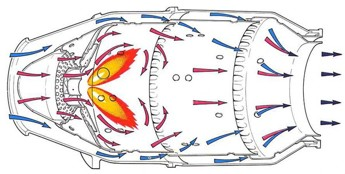
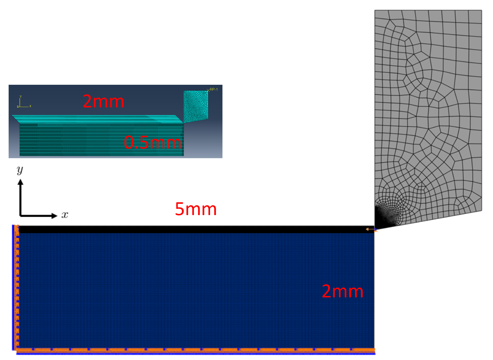
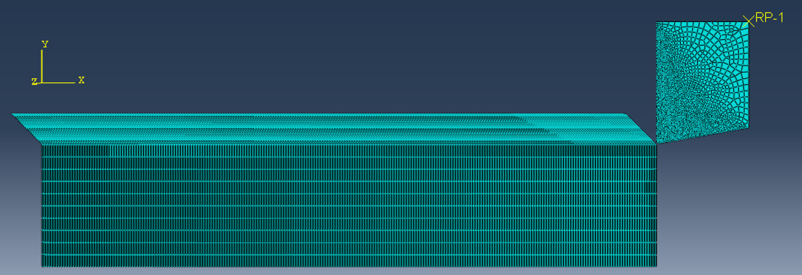
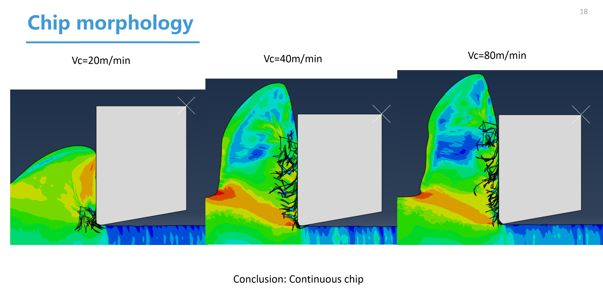
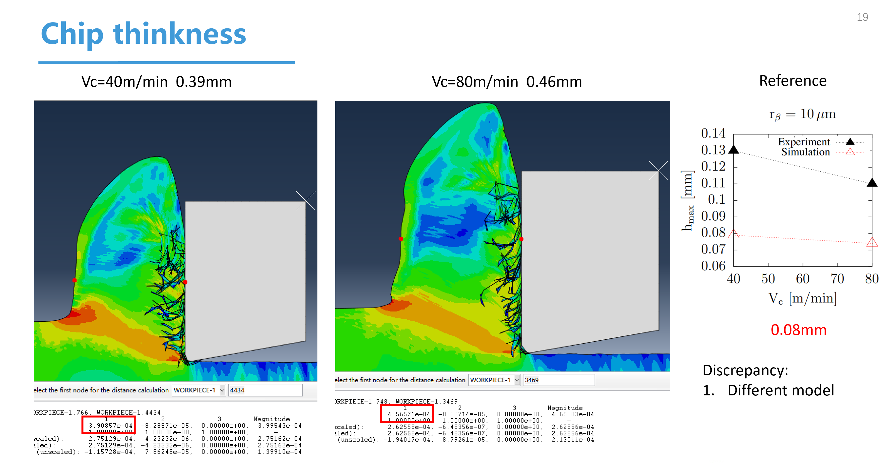

# 项目一：镍基高温合金 Inconel718 热力耦合切削仿真（2023年1月）
使用 Abaqus 建立 Johnson–Cook 塑性与损伤模型的全热-力耦合切削仿真

🔬 背景
-----

本研究面向 **Inconel 718（GH4169）** 的二维正交切削，依托 **Abaqus** 构建 **Johnson–Cook 热-力耦合**与损伤分离模型，系统评估切削速度对切削力、进给力、切削区温度与切屑形貌的影响，并与文献/实验对照验证。Inconel 718 以沉淀强化著称，具备高温强度与耐蚀性，但导热率低、加工硬化强、易积屑瘤，导致高热-机械负荷与刀具快速磨损。高保真数值仿真因此成为刀具设计与工艺优化的关键手段。

---

### 1. 温度场与切削力动态演化

  
  

  

---

### 2. 应用背景与有限元模型
<table>
  <tr>
    <td width="50%">
      
       <em>应用背景：航空涡轮发动机</em>
    </td>
    <td width="50%">
      
       <em>应用背景：发动机燃烧室</em>
    </td>
  </tr>
  <tr>
    <td>
      
       <em>二维正交切削有限元仿真模型</em>
    </td>
    <td>
      
       <em>仿真边界条件与几何示意</em>
    </td>
  </tr>
</table>

---

### 3. 不同切削速度下的切屑对比
<table>
  <tr>
    <td>
      
       <em>不同切削速度 \(V_c\) 下的切屑形状对比</em>
    </td>
    <td>
      
       <em>不同切削速度 \(V_c\) 下的切屑厚度对比</em>
    </td>
  </tr>
</table>

### 建模方法与物理模型

#### 1. 热模型

采用热力学第一定律的控制方程：

$$\rho c_p \frac{\partial T}{\partial t} - \frac{\partial}{\partial x_i} \left( \lambda \frac{\partial T}{\partial x_i} \right) = \dot{q}_p$$

其中 $c_p$、$\lambda$、$\alpha$ 为温度依赖型参数。热接触假设完全导通，刀具与工件界面热流连续。

#### 2. 力学模型

采用弹-塑性本构与 Johnson–Cook 塑性模型：

$$\sigma_{vM} = \left( A + B \varepsilon^n \right)\left[ 1 + C\ln\left( \frac{\dot{\varepsilon}}{\dot{\varepsilon}_0} \right) \right] \left[ 1 - \left( \frac{T - T_0}{T_m - T_0} \right)^m \right]$$

#### 3. 损伤与切屑分离

使用 Johnson–Cook 损伤准则：

$$\varepsilon_f = \left( d_1 + d_2 e^{-d_3 \sigma_m / \sigma_{vM}} \right) \left[ 1 + d_4 \ln\left( \frac{\dot{\varepsilon}}{\dot{\varepsilon}_0} \right) \right] \left[ 1 + d_5 \frac{T - T_0}{T_m - T_0} \right]$$

#### 4. 接触模型

库仑摩擦系数 $\mu = 0.5$，界面热导率取最大值。

* * *

### 几何与切削条件

#### 工件尺寸（mm）

| 长度 | 高度 | 进给 |
| --- | --- | --- |
| 5 | 2 | 0.1 |

#### 刀具几何

| 前角 (°) | 后角 (°) | 刀尖圆弧半径 (μm) |
| --- | --- | --- |
| 0 | 10 | 10 |

#### 切削速度

| m/min | m/s |
| --- | --- |
| 20 | 0.333 |
| 40 | 0.666 |
| 80 | 1.333 |

* * *

### 材料性能参数

#### 工件（Inconel 718）

* **密度**：$\rho = 8.22 \times 10^3 \ \mathrm{kg/m^3}$
    
* **温度依赖热物性**：
    
    * 比热 $c_p(T)$：20°C 时 440 J/(kg·°C)，至 1200°C 增至约 710 J/(kg·°C)
        
    * 导热率 $\lambda(T)$：20°C 时 10 N/(s·°C)，至 1200°C 约 31 N/(s·°C)
        
    * 热膨胀系数 $\alpha(T)$：20°C 时约 13×10⁻⁶/°C，700°C 时约 15.8×10⁻⁶/°C
        
* **弹性参数**：
    
    * 20°C：E = 217 GPa，v = 0.3
        
    * 871°C：E = 155.9 GPa，v = 0.3
        
* **Johnson–Cook 塑性参数**：
    
    * $$A=1485\ \mathrm{MPa}, B=904\ \mathrm{MPa}, n=0.777, C=0.015, m=1.689$$
        
    * $$\dot{\varepsilon}_0 = 10^{-3}\ \mathrm{s^{-1}}, T_0 = 20\ \mathrm{°C}, T_m = 1297\ \mathrm{°C}$$
        

#### 刀具（硬质合金 WC）

* **密度**：$\rho = 15.8 \times 10^3\ \mathrm{kg/m^3}$
    
* **比热**：20°C 时 200 J/(kg·°C)，高温趋于 260 J/(kg·°C)
    
* **导热率**：20°C 时 100 N/(s·°C)，高温降低至 65 N/(s·°C)
    
* **热膨胀系数**：$a = 5.4 \times 10^{-6} / \mathrm{°C}$
    

* * *

仿真结果
----

### 切削/进给力模型

切削力与进给力计算依模型定义（示意图略）。后续所有对比均按相同接触/摩擦与材料本构设置。

### 切削力对比（实验 vs. 文献仿真）

表 4.11：三种速度下，不同刀尖圆弧半径 $r_\beta$ 的切削力比较。为便于 GitHub 展示，将原始“分组列（colspan）”展平为并列列。

| $r_\beta$ (μm) | $F_c^{\text{exp}}$ @20 (N) | $F_c^{\text{sim}}$ @20 (N) | $F_c^{\text{exp}}$ @40 (N) | $F_c^{\text{sim}}$ @40 (N) | $F_c^{\text{exp}}$ @80 (N) | $F_c^{\text{sim}}$ @80 (N) |
| --- | --- | --- | --- | --- | --- | --- |
| 10 | 269 | 285.42 | 234 | 259.83 | 232 | 254.90 |
| 20 | 264 | 286.76 | 233 | 259.73 | 243 | 257.34 |
| 30 | 255 | 291.30 | 245 | 280.06 | 246 | 262.70 |

### 进给力对比（实验 vs. 文献仿真）

表 4.12：同样将分组列展平。注：Chip 距离标注见你原文“DRKPIECE-1.766，WORKPIECE-1.4434”。

| $r_\beta$ (μm) | $F_f^{\text{exp}}$ @20 (N) | $F_f^{\text{sim}}$ @20 (N) | $F_f^{\text{exp}}$ @40 (N) | $F_f^{\text{sim}}$ @40 (N) | $F_f^{\text{exp}}$ @80 (N) | $F_f^{\text{sim}}$ @80 (N) |
| --- | --- | --- | --- | --- | --- | --- |
| 10 | 235 | 128.09 | 192 | 113.06 | 181 | 104.74 |
| 20 | 260 | 138.65 | 222 | 118.08 | 230 | 120.82 |
| 30 | 269 | 144.94 | 254 | 144.76 | 252 | 136.41 |

### 我的仿真平均力（汇总）

为与上两表的“单一 $r_\beta$”数据区分，下面给出你**本次仿真的平均力**（按照你提供的“Force”表）：

|  | $V_c=20$ m/min | $V_c=40$ m/min | $V_c=80$ m/min |
| --- | --- | --- | --- |
| 平均切削力 $F_c$ (N) | 569.53 | 557.52 | 537.16 |
| 平均进给力 $F_f$ (N) | 247.29 | 270.24 | 264.24 |

### 实验/仿真/本次结果三向对照

将“实验 Exp / 文献仿真 Sim / 我的结果 My”在同一表中对齐，按速度分组展开：

| 量纲 | 20-Exp | 20-Sim | 20-My | 40-Exp | 40-Sim | 40-My | 80-Exp | 80-Sim | 80-My |
| --- | --- | --- | --- | --- | --- | --- | --- | --- | --- |
| 平均切削力 $F_c$ (N) | 269 | 285.42 | 569.53 | 234 | 259.83 | 557.52 | 232 | 254.90 | 537.16 |
| 平均进给力 $F_f$ (N) | 235 | 128.09 | 247.29 | 192 | 113.06 | 270.24 | 181 | 104.74 | 264.24 |

----

# 🚀 项目二：CuttingSim 参数化切削仿真研究（2023年6月）
基于 Abaqus的插件CuttingSim 进行刀具圆角、切削速度、摩擦系数等参数化研究

本研究依托 **Abaqus** 平台与其插件 **CuttingSim**，针对高温镍基合金 Inconel 718（GH4169）开展二维正交切削仿真，重点分析刀具圆角、切削速度、摩擦系数等工艺参数对切削力、进给力及切屑特性的影响。

与传统 Abaqus 手动建模相比，CuttingSim 提供了高度集成的 **热-力-几何一体化参数化建模**能力，使得在相同建模精度下可以快速批量生成仿真工况，极大提升了计算效率和数据获取量。本项目利用 CuttingSim 的优势，系统性完成了 **6 个特征量 × 多组合参数** 的 **36 组全因子仿真**，在相同时间内实现了大量参数扫描。

> 🔗 CuttingSim 介绍及教学视频： [领航科工 CuttingSim 专业切削仿真](https://space.bilibili.com/291170484/upload/video)

---

### 🛠 热-力-几何模型构建

- **热力学模型**：基于热力学第一定律，材料参数 \( c_p, \lambda, \alpha \) 全温度依赖；
- **弹性模型**：胡克定律，\( E \)、\( \nu \) 为温度依赖；
- **塑性模型**：Johnson–Cook 本构，包含应变率与温度软化效应；
- **材料分离模型**：Johnson–Cook 损伤准则，结合界面摩擦模拟切屑形成。

---

### 📊 参数与计算设置

- **变量范围**：
  - 刀具圆角 \( r_\beta = 10, 20, 30 \ \mu\text{m} \)
  - 切削速度 \( V_c = 20, 40, 80\ \mathrm{m/min} \)
  - 摩擦系数 \( \mu = 0, 0.5 \)
- **输出量**：
  - 切削力（CF）
  - 进给力（FF）
  - 切屑厚度（Chip Thickness）
- **总计算规模**：36 组参数化工况

---

### 📈 结果对比

#### 切削力变化趋势
- **随切削速度变化**：三种刀具圆角下，切削速度升高 → 切削力总体下降；
- **随刀具圆角变化**：不同切削速度下变化趋势不完全一致，需结合摩擦系数共同分析。

#### 进给力变化趋势
- **随切削速度变化**：多数情况下进给力随速度上升而降低；
- **随刀具圆角变化**：部分情况下出现进给力上升的反常现象，与摩擦及切削厚度有关。

#### 切屑厚度与形状
- 不同刀具圆角与切削速度下的切屑厚度变化趋势与文献结果基本一致，但数值存在一定偏差；
- 高速切削下切屑更薄，且形状更规则。

---

### 📷 成果展示

#### 切削力对比（不同刀具圆角）

#### 切削力对比（不同切削速度）

#### 进给力对比（不同刀具圆角）

#### 进给力对比（不同切削速度）

#### 切屑厚度与形状对比

---

### 💡 使用 CuttingSim 的优势与思考

1. **高效参数化建模**：通过图形化界面快速设定几何、材料、边界与摩擦等参数；
2. **批量工况生成**：支持一键生成多组参数组合，减少重复性建模工作量；
3. **计算与数据管理一体化**：自动命名与分类输出，便于后续数据分析与可视化；
4. **快速验证与迭代**：便于在设计阶段快速筛选出关键参数区间，指导实验和工艺优化。

---

## 📂 仓库结构

Inconel718-CuttingSim  
│  
├── project1_Abaqus/ # 2023年1月项目文件  
│ ├── CAD_models/ # 几何与网格  
│ ├── Material_data/ # Inconel718 及刀具材料属性  
│ ├── Abaqus_input/ # Abaqus .inp 输入文件  
│ ├── Results/ # 力、温度、切屑形貌结果  
│ └── Report/ # 最终报告 PDF  
│  
├── project2_CuttingSim/ # 2023年6月项目文件  
│ ├── CuttingSim_inputs/ # 参数化配置文件  
│ ├── Data/ # 仿真输出数据（csv/txt）  
│ ├── Plots/ # 绘图与对比曲线  
│ └── Report/ # 最终报告 PDF  
│  
└── README.md

---

## 🧩 建模方法

### 项目一 – Abaqus 热-力耦合模型
- **热模型**：热力学第一定律，考虑温度相关的 \( c_p \)、\(\lambda\)、\(\alpha\)  
- **力学模型**：弹-塑性，Johnson–Cook 塑性本构  
- **损伤模型**：Johnson–Cook 损伤准则实现切屑分离  
- **接触模型**：库仑摩擦（\(\mu = 0.5\)），热接触完全导通  
- **研究变量**：切削速度 \( V_c = 20, 40, 80\ \text{m/min} \)

### 项目二 – CuttingSim 参数化研究
- **研究变量**：
  - 刀具圆角 \( r = 10, 20, 30\ \mu\text{m} \)
  - 切削速度 \( V_c = 20, 40, 80\ \text{m/min} \)
  - 摩擦系数 \( \mu = 0, 0.5 \)
- **输出量**：
  - 切削力（CF）
  - 进给力（FF）
  - 切屑厚度与形貌
- **对比**：我的仿真结果 vs. 文献仿真结果 vs. 实验结果

---

## 📊 仿真结果与对比

### 项目一（Abaqus）
- 切削力与进给力随速度变化趋势  
- 切削区温度场分布  
- 切屑形貌与厚度  

**示例结果**：  
  
  

---

### 项目二（CuttingSim）
- 不同刀具圆角与切削速度下的力变化趋势  
- 切屑厚度变化规律  
- 与参考数据的吻合程度分析  

**示例结果**：  
  
  

---

## 📚 参考文献

1. Rinaldi S, Imbrogno S, Rotella G, et al. *Physics based modeling of machining Inconel 718 to predict surface integrity modification*. Procedia CIRP, 2019, 82: 350–355.  
2. Bedzra R. *Finite element simulation of two dimensional orthogonal cutting process and comparison with experiments*. RWTH Aachen University, 2013.

---

## 🚀 运行方法

### 项目一（Abaqus）
1. 在 Abaqus CAE 中加载 `.inp` 文件  
2. 从 `Material_data/` 中导入材料属性  
3. 运行热-力耦合温度-位移分析  
4. 在 Abaqus Viewer 中进行后处理  

### 项目二（CuttingSim）
1. 打开 CuttingSim 软件  
2. 加载 `CuttingSim_inputs/` 中的参数文件  
3. 运行仿真并保存输出结果  
4. 使用 `Plots/` 中的脚本进行绘图对比  

---

## 📌 注意事项
- 所有材料参数均为温度依赖型，取自文献数据  
- 仿真与实验的差异主要来自模型简化与边界条件假设  
- 本 README 中所有图片为占位符，需替换为实际结果

